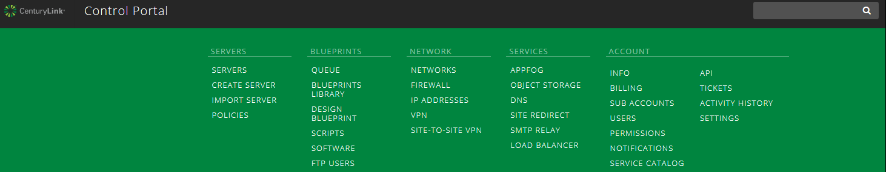
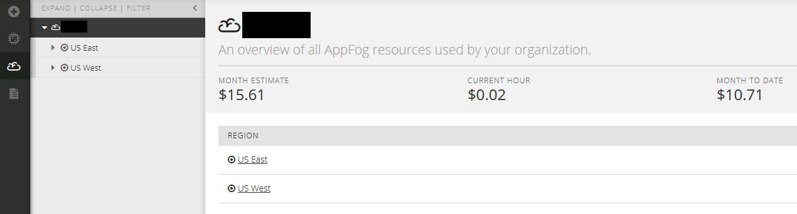
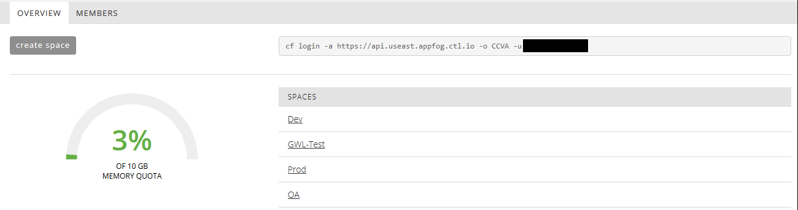

**AppFog demo:**

The sample program is located at
<https://github.com/gavin-lai/hello-world>.

Log in to control.ctl.io using the control credential:

Either click on the cloud icon or select AppFog under Services from the
drop down menu to access AppFog from the Control Portal

Summary page for the current deployment:

Select one of the Region:

The Region page will have the login information and the spaces reside in
the region. The login information is required for logging in to AppFog
via the Cloud Foundry CLI.

-   Select or create a space to deploy the program by clicking on the
    name of the space or ‘Create Space’

-   Type in the name for new space when creating new space

    

For example, Space ‘Dev’ has no active application

From here, the cost of the current deployment is displayed. There are
four tabs on this page:

-   Applications – list of all applications deployed and running in this
    space

-   Members – display the members of this space

    -   There are 3 different roles can be defined for members

        -   Space Manager

        -   Space Developer

        -   Space Auditor

            

-   Services – List all services subscribe as part of the application

 

-   Routes – List routes for all the applications

    

In order to deploy an application, navigate to the ‘App’ tab and click
on “deploy an app” button

Next pick the region, group, the name of the application, the number of
instances, and amount of memory required by the application, also
provide the URL of the zip file of the application (for example from
Github <https://github.com/gavin-lai/hello-world/archive/master.zip>.).
Then the application can be deployed by clicking on the “deploy app”
button.

The build log will be displayed on the screen and at the end (if the
deployment is successful), the following is shown at the end of the
deployment.

Click on “View ‘app name’ app details” link to see the details of the
application.

From here, you can start, stop, scale and delete
the application. In the scale screen, additional instances and memory
can be added to the deployment with the slider.

To test the application and its load balance feature, use a browser (or
curl in command line) to navigate to the URL of the application multiple
times(in this example:
[hello-gl.useast.appfog.ctl.io](http://hello-gl.useast.appfog.ctl.io)),
the output will show the responses come back from different hosts as the
following:

Or

Depending on the number of instances that were deployed, the responses
will come back from the same number of hosts.

**Install Cloud Foundry CLI**

Download the appropriate [binary distribution of the Cloud Foundry
CLI](https://github.com/cloudfoundry/cli/blob/master/README.md#downloads).
Install the downloaded binary distribution of Cloud Foundry CLI. To
verify Cloud Foundry CLI is installed run the following command from a
command prompt or a Git Shell:

). Change directory to the root
directory of the application and login to AppFog as follows using the
credential of the control portal. Then select the space that the
application will be deployed in.

Select the space and from the prompt type ‘cf push –i 2’ (I is the
number of instances). Once completed, the prompt will be returned and
the URL is provided for testing.
